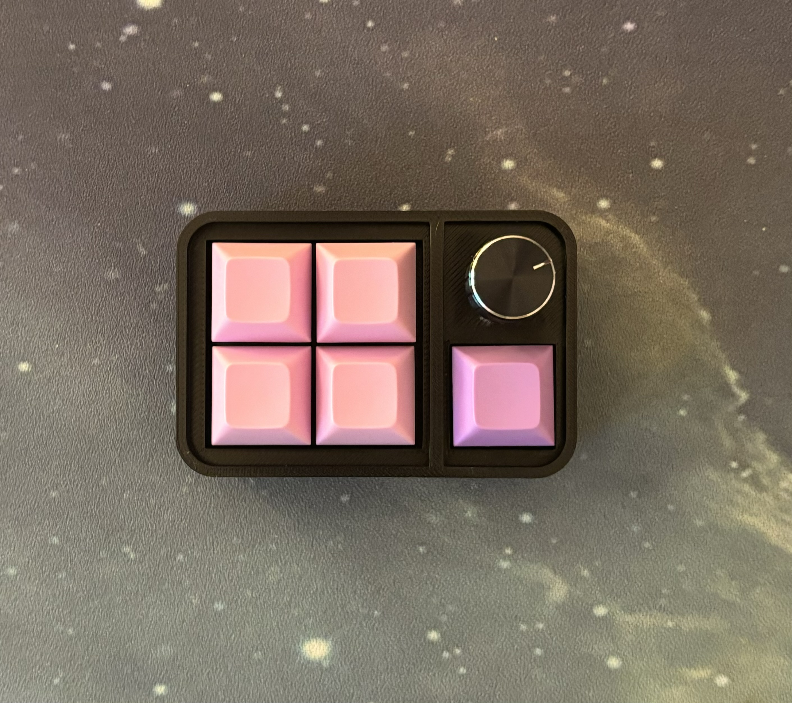

# Pengypad

A macropad made from "scratch" using [Tiny USB](https://github.com/hathach/tinyusb) and the pico sdk in C.

<div style="text-align: center;">
    
</div>

## Things Used

+ Microcontroller: RP2040 Zero  
+ Case: [Print Files](/printFiles/)
+ Switches: Durock Shrimps
+ Keycaps: https://www.etsy.com/listing/1358529198/dsa-pbt-keycap-blanks-25-colors
+ Encoder: https://www.amazon.com/dp/B07DM2YMT4?psc=1&ref=ppx_yo2ov_dt_b_product_details

## Build Instructions

+ Prerequisites:
  + [pico sdk](https://datasheets.raspberrypi.com/pico/getting-started-with-pico.pdf#page=7) setup and ready
  + make  
  + cmake
+ Building:
  + linux:
    + set buildAll.sh script to executable and run it
  + windows:
        **NOTE:** This has not been tested
    + make build directory in root
    + cd into build directory
    + run ```cmake ..```
    + cd into pengypad
    + run ```make```

## Configuration  

+ To find out what keycodes you need please refer to the hid [keycodes](https://github.com/hathach/tinyusb/blob/cfbdc44a8d099240ad5ef208bd639487c2f28153/src/class/hid/hid.h#L370)
+ Then change what the keys/encoder are mapped by changing the arrays in [mappings](src/mappings.h)
